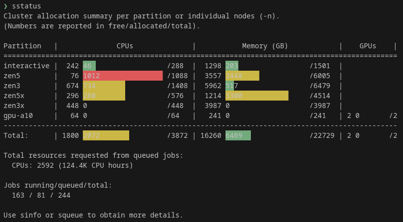
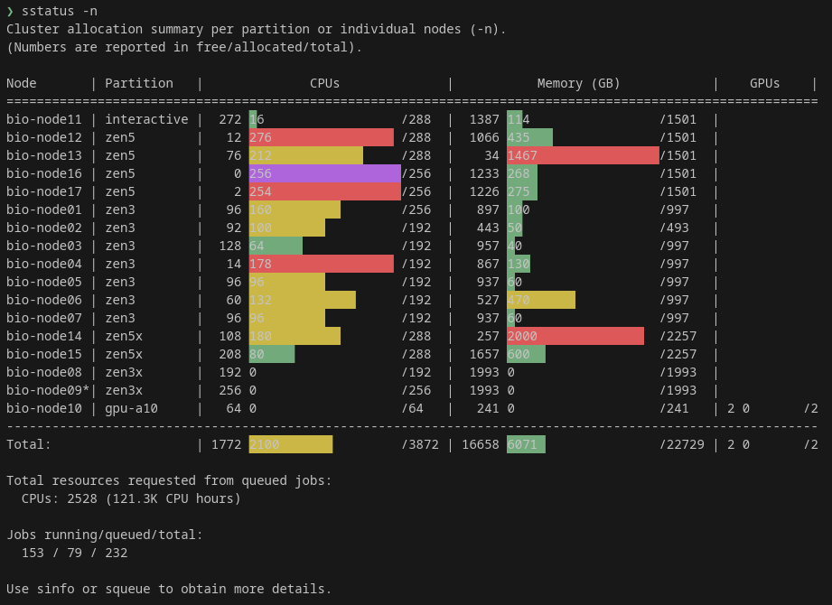

# sstatus
`sstatus` shows a quick overview of the current allocation status of a SLURM cluster with some colored bars per partition or node. It also shows some info about pending jobs and upcoming reservations. When a node is unavailable, it will be marked with an asterisk `*`.

## Usage
```
$ sstatus -h
usage: sstatus [-h] [-n]

Displays SLURM cluster allocation summary by partition or per node. https://github.com/KasperSkytte/sstatus

options:
  -h, --help   show this help message and exit
  -n, --nodes  show per-node status instead of by partition.
```

## Screenshots
### Per partition


### Per node

