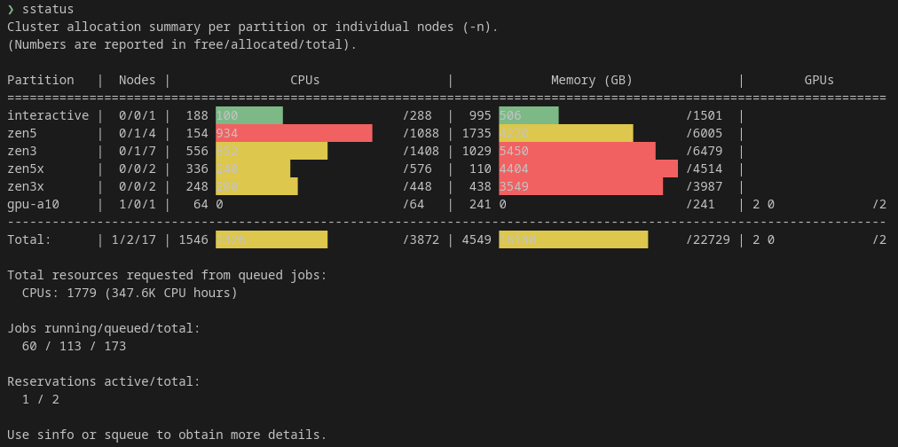
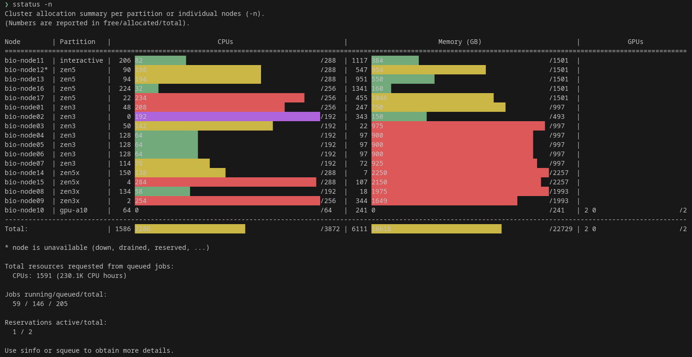

# sstatus
`sstatus` shows a quick overview of the current allocation status of a SLURM cluster with some colored bars per partition or node. It also shows some info about pending jobs and upcoming reservations. When a node is unavailable (based on reason codes), it will be marked with an asterisk `*`. Data is collected from `sinfo`, `squeue`, and `scontrol`. Column alignment scales dynamically to the length of node and partition names as well as the current terminal window size (best effort).

## Requirements
Just python3 and its default packages. A slurm cluster, obviously.

## Usage
```
$ sstatus -h
usage: sstatus [-h] [-n] [-f | -w COLUMNS] [--no-colour]

Displays a SLURM cluster allocation summary by partition or per node. https://github.com/KasperSkytte/sstatus

options:
  -h, --help            show this help message and exit
  -n, --nodes           show per-node status instead of by partition.
  -f, --fill            stretch the table to fill the width of the window.
  -w COLUMNS, --width COLUMNS
                        stretch the table to fill this many columns.
  --no-colour, --no-color
                        don't colourize the bars.
```

By default the table is only as wide as it has to be: enough for the longest node and partition names, 20 characters per bar (8 for GPUs) or more if the allocated value needs it, plus the numbers printed on either side. With `-f`/`--fill` the bars stretch to fill the terminal window instead. The minimum always applies, so a window narrower than the table won't squash the columns.

## Screenshots
### Per partition


### Per node

